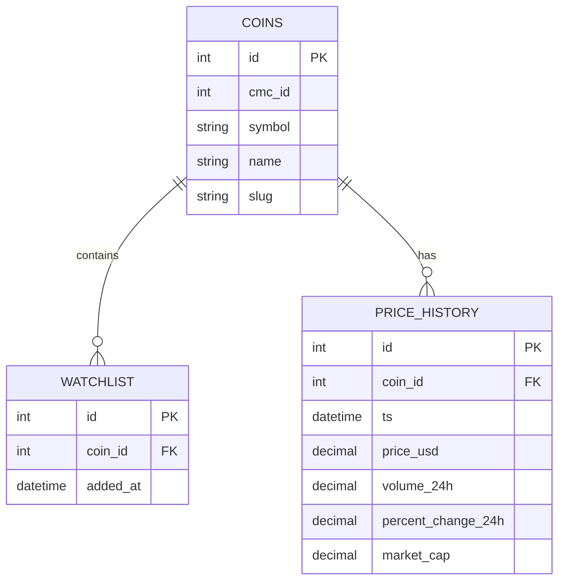

# Modelo Entidad-Relación (ERD)

```mermaid
erDiagram
  COINS ||--o{ WATCHLIST : contains
  COINS ||--o{ PRICE_HISTORY : has

  COINS {
    int id PK
    int cmc_id
    string symbol
    string name
    string slug
  }

  WATCHLIST {
    int id PK
    int coin_id FK
    datetime added_at
  }

  PRICE_HISTORY {
    int id PK
    int coin_id FK
    datetime ts
    decimal price_usd
    decimal volume_24h
    decimal percent_change_24h
    decimal market_cap
  }
```
